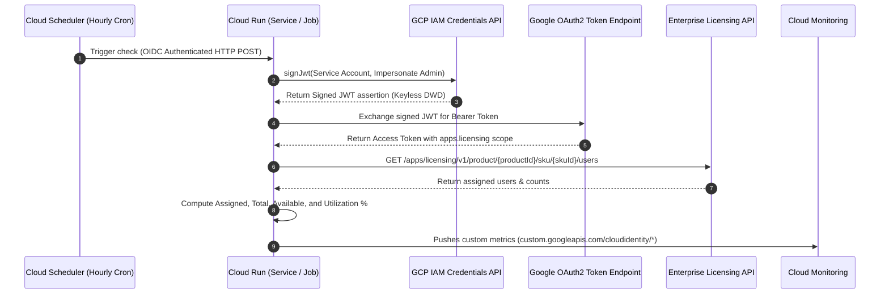

# Google Cloud Identity & Workspace License Monitor

An enterprise-ready, serverless solution to monitor Google Cloud Identity and Google Workspace license assignments, compute available seats, and push custom telemetry to **Google Cloud Monitoring** for alerting and dashboards.

---
## Disclaimer

This migration tool is provided without any warranty, make sure you review the script code and test accordingly with your requirements.
Always make sure you have backups and have **validated** recovery from those backups before running, especially in production environments.
This cannot be stressed enough.

---
## Architecture Overview



### Highlights:
- **Zero Stored Secrets (Keyless Domain-Wide Delegation)**: No service account JSON key files on disk or in secrets managers. JWT signing is performed on-the-fly via Google Cloud IAM `signJwt`.
- **Cloud Monitoring Native**: Emits 4 metrics per SKU (`assigned_licenses`, `total_licenses`, `available_licenses`, and `utilization_percent`).
- **Flexible Execution Modes**:
  - **Serverless Webhook**: Cloud Run Service triggered by Cloud Scheduler (default).
  - **On-Demand Batch Job**: Cloud Run Job triggered via CLI or CI/CD pipelines.
  - **Local CLI**: Runs directly in Python virtual environments.
- **Dynamic SKU Configuration**: Monitor default Cloud Identity Free/Premium, or provide a `skus.json` file / `MONITORED_SKUS` variable to monitor any Google Workspace SKU.

---

## Metrics Emitted to Cloud Monitoring

All metrics are published under the `global` resource type:

| Metric Type | Type | Unit | Description |
| :--- | :--- | :--- | :--- |
| `custom.googleapis.com/cloudidentity/assigned_licenses` | INT64 | 1 | Number of licenses currently assigned to users. |
| `custom.googleapis.com/cloudidentity/total_licenses` | INT64 | 1 | Total purchased/configured license quota. |
| `custom.googleapis.com/cloudidentity/available_licenses` | INT64 | 1 | Number of unassigned licenses remaining (`total - assigned`). |
| `custom.googleapis.com/cloudidentity/utilization_percent` | DOUBLE | % | Percentage of licenses consumed (`assigned / total * 100`). |

**Labels attached to each metric:**
- `sku_id`: e.g. `1010050001` (Cloud Identity Premium), `1010010001` (Cloud Identity Free).
- `sku_name`: e.g. `Cloud Identity Premium`, `Cloud Identity Free`.

---

## Quickstart (Deployment in < 5 Minutes)

### 1. Clone the Repository
```bash
git clone <repository-url>
cd cloudidentity-license-monitor
```

### 2. Configure Environment
Copy the `.env.example` file to `.env`:
```bash
cp .env.example .env
```

Edit `.env` with your project and domain parameters:
```bash
# [REQUIRED] Google Cloud Project ID
GCP_PROJECT_ID="your-gcp-project-id"

# [REQUIRED] Super Admin or Delegated Admin email
WORKSPACE_ADMIN_EMAIL="admin@yourdomain.com"

# Total purchased seats (used for availability calculation)
TOTAL_PURCHASED_SEATS_PREMIUM="100"
TOTAL_PURCHASED_SEATS_FREE="50"

# [OPTIONAL] GCP Region (default: us-central1)
GCP_REGION="us-central1"
```

### 3. Run Automated Deployment
```bash
./deploy.sh
```

The script will:
1. Enable all required GCP APIs.
2. Create the Artifact Registry Docker repository.
3. Provision the Service Account with `metricWriter`, `logWriter`, and `signJwt` self-delegation.
4. Build the container image via Cloud Build.
5. Deploy the Cloud Run Service and Cloud Run Job.
6. Configure the hourly Cloud Scheduler trigger.
7. Output the **Client ID** for Google Workspace authorization.

### 4. Authorize in Google Workspace Admin Console (One-Time)
1. Open [Google Admin Console: Domain-Wide Delegation](https://admin.google.com/ac/owl/domainwidedelegation).
2. Click **Add new**.
3. In **Client ID**, enter the numeric Client ID displayed at the end of `./deploy.sh`.
4. In **OAuth scopes**, paste:
   ```
   https://www.googleapis.com/auth/apps.licensing
   ```
5. Click **Authorize**.

### 5. Verify Setup
Run a live test via the Cloud Run Job:
```bash
gcloud run jobs execute cloudidentity-license-monitor-job --region=us-central1 --wait
```

Or trigger the Cloud Scheduler job:
```bash
gcloud scheduler jobs run scheduled-license-monitor --location=us-central1
```

---

## Alternative Deployment Options

- **Terraform**: Complete HCL modules are provided in [`terraform/`](terraform/). See [DEPLOYMENT.md](DEPLOYMENT.md#method-2-terraform-deployment).
- **Manual `gcloud`**: Step-by-step shell commands are documented in [DEPLOYMENT.md](DEPLOYMENT.md#method-3-manual-step-by-step-deployment).

---

## Configuration Reference

### Environment Variables

| Variable | Required | Default | Description |
| :--- | :---: | :--- | :--- |
| `GCP_PROJECT_ID` | **Yes** | Auto-detected | Target Google Cloud Project ID. |
| `WORKSPACE_ADMIN_EMAIL` | **Yes** | None | Admin email to impersonate via Domain-Wide Delegation. |
| `WORKSPACE_CUSTOMER_ID` | No | Domain part of admin email | Google Workspace customer domain or customer ID. |
| `GCP_REGION` | No | `us-central1` | Deployment region for Cloud Run and Scheduler. |
| `SERVICE_ACCOUNT_NAME` | No | `license-monitor-sa` | Base name for the service account. |
| `TOTAL_PURCHASED_SEATS_PREMIUM` | No | `50` | Total purchased Cloud Identity Premium seats. |
| `TOTAL_PURCHASED_SEATS_FREE` | No | `50` | Total purchased Cloud Identity Free seats. |
| `CRON_SCHEDULE` | No | `0 * * * *` | Cron schedule for the Cloud Scheduler job. |
| `MONITORED_SKUS` | No | None | Optional JSON string defining custom SKUs to monitor. |
| `SKUS_CONFIG_FILE` | No | `skus.json` | Path to a custom JSON file defining SKUs. |

---

## Monitoring Custom Products & SKUs

To monitor other Google Workspace licenses, create a `skus.json` file in the project directory (or pass `MONITORED_SKUS` in `.env`):

```json
[
  {
    "name": "Cloud Identity Premium",
    "productId": "101005",
    "skuId": "1010050001",
    "totalSeats": 100
  },
  {
    "name": "Cloud Identity Free",
    "productId": "101001",
    "skuId": "1010010001",
    "totalSeats": 50
  },
  {
    "name": "Google Workspace Enterprise Plus",
    "productId": "Google-Apps",
    "skuId": "1010020027",
    "totalSeats": 200
  }
]
```

### Common Product & SKU IDs

| Product / Edition | Product ID | SKU ID |
| :--- | :--- | :--- |
| **Cloud Identity Free** | `101001` | `1010010001` |
| **Cloud Identity Premium** | `101005` | `1010050001` |
| **Google Workspace Business Starter** | `Google-Apps` | `1010020029` |
| **Google Workspace Business Standard** | `Google-Apps` | `1010020025` |
| **Google Workspace Business Plus** | `Google-Apps` | `1010020026` |
| **Google Workspace Enterprise Standard** | `Google-Apps` | `1010020028` |
| **Google Workspace Enterprise Plus** | `Google-Apps` | `1010020027` |

---

## Setting up Alerts in Google Cloud Monitoring

You can configure an alert policy to notify your team via Email, Slack, or PagerDuty when available licenses drop below a safety threshold:

### Example: Alert when Available Licenses < 5
1. Go to **Cloud Monitoring** > **Alerting** > **Create Policy**.
2. Select Metric:
   - Resource: `Global`
   - Metric: `custom.googleapis.com/cloudidentity/available_licenses`
3. Filter: `sku_id = "1010050001"` (or apply to all SKUs).
4. Configure trigger condition:
   - Condition: **Any time series violates**
   - Threshold: **Value is below 5**
   - Duration: **Most recent value**
5. Notification Channels: Select your PagerDuty, Slack, or Email channel.
6. Documentation:
   ```markdown
   Cloud Identity licenses are critically low!
   Current available count is under 5. Please provision additional licenses in admin.google.com.
   ```

---

## Local Development & Testing

You can run the monitor directly from your workstation:

```bash
# 1. Create and activate a virtual environment
python3 -m venv .venv
source .venv/bin/activate

# 2. Install dependencies
pip install -r requirements.txt

# 3. Export environment variables
export GCP_PROJECT_ID="your-project-id"
export WORKSPACE_ADMIN_EMAIL="admin@yourdomain.com"
export SERVICE_ACCOUNT_EMAIL="license-monitor-sa@your-project-id.iam.gserviceaccount.com"

# 4. Authenticate gcloud
gcloud auth login
gcloud auth application-default login

# 5. Execute single test run
python main.py --run-once
```

---

## Cleanup & Teardown

To delete all provisioned infrastructure (Scheduler, Cloud Run Service, Cloud Run Job, Service Account, and Artifact Registry repository):

```bash
./destroy.sh
```
Or if deployed with Terraform:
```bash
cd terraform && terraform destroy
```
